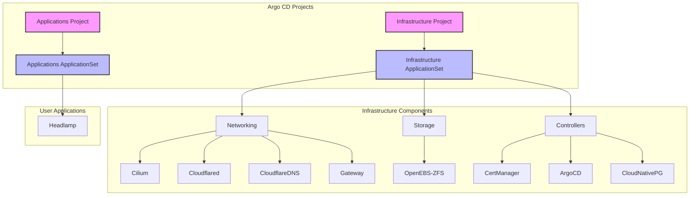

K3s GitOps Cluster
==================

GitOps-managed Kubernetes cluster using Argo CD on K3s with Cilium, cert-manager, Cloudflare Tunnel, and CloudNative-PG.

## Table of Contents

- [Architecture](#architecture)
- [Infrastructure Components](#infrastructure-components)
- [Applications](#applications)
- [Quick Start](#quick-start)
- [License](#license)

## Architecture



### Key Features
- **GitOps Structure**: Two-level Argo CD ApplicationSets for infrastructure/apps
- **Security Boundaries**: Separate projects with RBAC enforcement
- **Sync Waves**: Infrastructure deploys first (negative sync waves)
- **Self-Healing**: Automated sync with pruning and failure recovery

## Infrastructure Components

| Component | Description | Version |
|-----------|-------------|---------|
| **Cilium** | CNI, kube-proxy replacement, L2 announcements, Hubble, Gateway API integration | 1.19.1 |
| **Gateway API** | Internal (10.0.50.202) and external (10.0.50.200) gateways with wildcard TLS | Cilium-based |
| **Cloudflared** | DaemonSet for Cloudflare Tunnel (tunnel `rpi5`) | 2026.2.0 |
| **external-dns** | Cloudflare DNS management via DNSEndpoint CRDs | 1.16.2 |
| **cert-manager** | Let's Encrypt DNS01 via Cloudflare, ClusterIssuer `cloudflare-cluster-issuer` | 1.19.4 |
| **Argo CD** | GitOps with kustomize-build-with-helm CMP, two AppProjects | 9.4.5 |
| **OpenEBS ZFS LocalPV** | Default StorageClass `zfs-localpv`, pool `Data`, lz4 compression | 2.10.0 |
| **CloudNative-PG** | PostgreSQL operator, cluster-wide mode | 0.28.2 |

## Applications

| Application | Description | Access |
|-------------|-------------|--------|
| **Headlamp** | Kubernetes web UI with cluster-admin SA | `headlamp.saleem.us` via internal gateway |

Additional services (e.g., Immich at `photos.saleem.us`) are deployed on the cluster but not managed through this repository.

## Quick Start

### Setup k3s
```
# Customize these values!
export SETUP_NODEIP=192.168.101.176  # Your node IP
export SETUP_CLUSTERTOKEN=randomtokensecret12343  # Strong token

curl -sfL https://get.k3s.io | INSTALL_K3S_VERSION="v1.35.1+k3s1" \
  INSTALL_K3S_EXEC="--node-ip $SETUP_NODEIP \
  --disable=flannel,local-storage,metrics-server,servicelb,traefik \
  --flannel-backend='none' \
  --disable-network-policy \
  --disable-cloud-controller \
  --disable-kube-proxy" \
  K3S_TOKEN=$SETUP_CLUSTERTOKEN \
  K3S_KUBECONFIG_MODE=644 sh -s -

# Configure kubectl access
mkdir -p $HOME/.kube && sudo cp -i /etc/rancher/k3s/k3s.yaml $HOME/.kube/config
sudo chown $(id -u):$(id -g) $HOME/.kube/config && chmod 600 $HOME/.kube/config
```

### Install Cilium
```bash
# Install Cilium CLI
## CHECK ARCH FIRST
CILIUM_CLI_VERSION=$(curl -s https://raw.githubusercontent.com/cilium/cilium-cli/main/stable.txt)
CLI_ARCH=amd64 && [ "$(uname -m)" = "aarch64" ] && CLI_ARCH=arm64
curl -L --fail --remote-name-all \
  https://github.com/cilium/cilium-cli/releases/download/${CILIUM_CLI_VERSION}/cilium-linux-${CLI_ARCH}.tar.gz{,.sha256sum}
sha256sum --check cilium-linux-${CLI_ARCH}.tar.gz.sha256sum
sudo tar xzvfC cilium-linux-${CLI_ARCH}.tar.gz /usr/local/bin
rm cilium-linux-${CLI_ARCH}.tar.gz*

# Helm install Cilium
# use  helm install if first time, or helm upgrade if trying to update/upgrade/redo something 
helm repo add cilium https://helm.cilium.io && helm repo update
helm install cilium cilium/cilium -n kube-system \
  -f infrastructure/networking/cilium/values.yaml \
  --version 1.19.1 \
  --set operator.replicas=1

# Validate installation
cilium status && cilium connectivity test

# Critical L2 Configuration Note:
# Before applying the CiliumL2AnnouncementPolicy, you MUST identify your correct network interface:

# 1. List all network interfaces:
ip a

# 2. Look for your main interface with an IP address matching your network
# Common interface names:
# - Ubuntu/Debian: enp1s0, ens18, eth0
# - macOS: en0
# - RPi: eth0
# The interface should show your node's IP address, for example:
#   enp1s0: <BROADCAST,MULTICAST,UP,LOWER_UP> ... inet 192.168.1.100/24

# 3. Make note of your interface name for the CiliumL2AnnouncementPolicy
# You'll need this when applying the infrastructure components via Argo CD

# DO NOT apply the policy here - it will be applied through Argo CD
# The policy file is located at: infrastructure/networking/cilium/l2policy.yaml
```

#### Setup GitOps
```bash
# Install Helm
curl https://raw.githubusercontent.com/helm/helm/main/scripts/get-helm-3 | bash

# Gateway API CRDs
kubectl apply -f https://github.com/kubernetes-sigs/gateway-api/releases/download/v1.4.1/standard-install.yaml
kubectl apply -f https://github.com/kubernetes-sigs/gateway-api/releases/download/v1.4.1/experimental-install.yaml

# Argo CD Bootstrap
kubectl create namespace argocd
kubectl kustomize --enable-helm infrastructure/controllers/argocd | kubectl apply -f -
kubectl apply -f infrastructure/controllers/argocd/projects.yaml

# Wait for Argo CD
kubectl wait --for=condition=Ready pod -l app.kubernetes.io/name=argocd-server -n argocd --timeout=300s

# Get initial password (change immediately!)
ARGO_PASS=$(kubectl get secret argocd-initial-admin-secret -n argocd -o jsonpath="{.data.password}" | base64 -d)
echo "Initial Argo CD password: $ARGO_PASS"

# Generate a New Password:
# Use a bcrypt hash generator (e.g. https://www.browserling.com/tools/bcrypt)
# Then update the argocd-secret secret with your new bcrypt hash:
kubectl -n argocd patch secret argocd-secret \
  -p '{"stringData": { "admin.password": "<YOUR_BCRYPT_HASH>", "admin.passwordMtime": "'$(date +%FT%T%Z)'" }}'
```

### Install Prerequisites

Install [mise](https://mise.jdx.dev) to manage required tool versions:
```bash
curl https://mise.jdx.dev/install.sh | sh
mise install
```

This installs `sops`, `age`, `kubectl`, `helm`, and `kustomize` at the versions specified in `.mise.toml`.

### SOPS Secret Management

Secrets are encrypted with [SOPS](https://github.com/getsops/sops) using [age](https://age-encryption.org).

#### Generate an age key (first time only)

```bash
mkdir -p ~/.config/sops/age
age-keygen -o ~/.config/sops/age/keys.txt
```

This outputs your public key. Add it to `.sops.yaml` at the repo root:
```yaml
creation_rules:
  - path_regex: infrastructure/.*\.sops\.ya?ml
    encrypted_regex: "^(data|stringData)$"
    mac_only_encrypted: true
    age: "age1..."  # your public key here
```

#### Seed the age key in the cluster

Argo CD needs the age private key to decrypt secrets during builds:
```bash
kubectl create secret generic sops-age-key \
  --namespace argocd \
  --from-file=keys.txt=~/.config/sops/age/keys.txt
```

#### Edit an encrypted secret

```bash
sops infrastructure/networking/cloudflare-dns/secret.sops.yaml
```

This opens the decrypted file in your editor. Save and exit to re-encrypt.

### Setup CloudFlare and Certificates
```bash
# REQUIRED BROWSER STEPS FIRST:
# Navigate to Cloudflare Dashboard:
# 1. Profile > API Tokens
# 2. Create Token
# 3. Use "Edit zone DNS" template
# 4. Configure permissions:
#    - Zone - DNS - Edit
#    - Zone - Zone - Read
# 5. Set zone resources to your domain
# 6. Copy the token and your Cloudflare account email

# Set credentials - NEVER COMMIT THESE!
export CLOUDFLARE_API_TOKEN="your-api-token-here"
export CLOUDFLARE_EMAIL="your-cloudflare-email"
export DOMAIN="yourdomain.com"
export TUNNEL_NAME="k3s-cluster"

# Install cloudflared
# Linux:
wget -q https://github.com/cloudflare/cloudflared/releases/latest/download/cloudflared-linux-amd64.deb
sudo dpkg -i cloudflared-linux-amd64.deb
# macOS:
brew install cloudflare/cloudflare/cloudflared

# Authenticate (opens browser)
cloudflared tunnel login

# Generate credentials (run from $HOME)
cloudflared tunnel create $TUNNEL_NAME
cloudflared tunnel token --cred-file tunnel-creds.json $TUNNEL_NAME

export DOMAIN="yourdomain.com"
export TUNNEL_NAME="k3s-cluster"  # This should match the name in your config.yaml

# Create namespace for cloudflared
kubectl create namespace cloudflared

# Create Kubernetes secret
kubectl create secret generic tunnel-credentials \
  --namespace=cloudflared \
  --from-file=credentials.json=tunnel-creds.json

# DNS is now managed by external-dns via DNSEndpoint CRDs.
# Delete old wildcard DNS records from Cloudflare dashboard.

# Create external-dns secret via SOPS:
cd infrastructure/networking/cloudflare-dns
sops --set '["stringData"]["api-token"] "'"$CLOUDFLARE_API_TOKEN"'"' secret.sops.yaml
cd -

# Create cert-manager secrets
kubectl create namespace cert-manager
kubectl create secret generic cloudflare-api-token -n cert-manager \
  --from-literal=api-token=$CLOUDFLARE_API_TOKEN \
  --from-literal=email=$CLOUDFLARE_EMAIL

# Verify secrets
kubectl get secret cloudflare-api-token -n cert-manager -o jsonpath='{.data.email}' | base64 -d
kubectl get secret cloudflare-api-token -n cert-manager -o jsonpath='{.data.api-token}' | base64 -d
```

### Final Deployment

```bash
# Apply infrastructure components (from repo root)
kubectl apply -f infrastructure/controllers/argocd/projects.yaml -n argocd
kubectl apply -f infrastructure/infrastructure-components-appset.yaml -n argocd

# Deploy applications
kubectl apply -f my-apps/myapplications-appset.yaml
```

## License

MIT - see [LICENSE](LICENSE).
