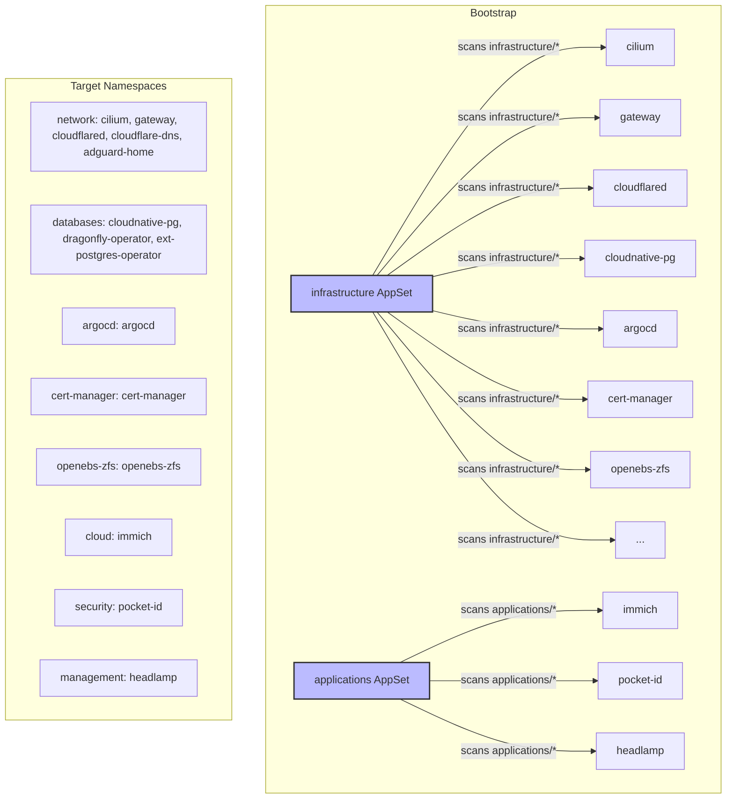

K3s GitOps Cluster
==================

GitOps-managed Kubernetes cluster using Argo CD on K3s with Cilium, cert-manager, Cloudflare Tunnel, and CloudNative-PG.

## Table of Contents

- [Architecture](#architecture)
- [Infrastructure Components](#infrastructure-components)
- [Applications](#applications)
- [Prerequisites](#prerequisites)
- [Bootstrap](#bootstrap)
- [SOPS Secret Management](#sops-secret-management)
- [License](#license)

## Architecture



Each component's `kustomization.yaml` sets `namespace:` to the target namespace. The AppSet's `destination.namespace` (`{{path.basename}}`) is just a fallback — the actual namespace comes from kustomize.

## Infrastructure Components

| Component | Description | Version |
|-----------|-------------|---------|
| **Cilium** | CNI, kube-proxy replacement, L2 announcements, Hubble, Gateway API | 1.19.1 |
| **Gateway API** | Internal (10.0.50.202) and external (10.0.50.200) gateways, wildcard TLS | Cilium-based |
| **Cloudflared** | DaemonSet, wildcard `*.saleem.us` → gateway-external | 2026.2.0 |
| **external-dns** | Cloudflare DNS via DNSEndpoint CRDs (no gateway-httproute source) | 1.21.1 |
| **cert-manager** | Let's Encrypt DNS01 via Cloudflare, ClusterIssuer `cloudflare-cluster-issuer` | 1.19.4 |
| **Argo CD** | GitOps with kustomize-build-with-helm CMP (sops decryption) | 9.4.5 |
| **OpenEBS ZFS LocalPV** | Default StorageClass `zfs-localpv`, pool `Data`, lz4 compression | 2.10.0 |
| **CloudNative-PG** | PostgreSQL operator, cluster-wide mode | 0.28.2 |
| **Dragonfly** | Redis-compatible in-memory store (operator + instance) | 1.5.0 |
| **ext-postgres-operator** | Creates databases from PostgresUser CRDs | 3.0.0 |
| **AdGuard Home** | Network-wide ad blocking (internal) | latest |

## Applications

| Application | Description | Namespace | Access |
|-------------|-------------|-----------|--------|
| **Immich** | Photo management | `cloud` | `photos.saleem.us` |
| **Pocket ID** | OIDC identity provider | `security` | `pid.saleem.us` |
| **Headlamp** | Kubernetes web UI | `management` | `headlamp.saleem.us` |
| **Argo CD** | GitOps UI | `argocd` | `argocd.saleem.us` (internal) |

## Prerequisites

### Required tools

```bash
# Install mise for tool version management
curl https://mise.jdx.dev/install.sh | sh
mise install
```

This installs `sops`, `age`, `kubectl`, `helm`, and `kustomize`.

### Age key (first time only)

```bash
mkdir -p ~/.config/sops/age
age-keygen -o ~/.config/sops/age/keys.txt
```

Add the public key to `.sops.yaml` at the repo root.

### K3s install

```bash
# Customize these values!
export SETUP_NODEIP=192.168.101.176  # Your node IP
export SETUP_CLUSTERTOKEN=randomtokensecret12343  # Strong token

curl -sfL https://get.k3s.io | INSTALL_K3S_VERSION="v1.36.1+k3s1" \
  INSTALL_K3S_EXEC="--node-ip $SETUP_NODEIP \
  --disable=flannel,local-storage,metrics-server,servicelb,traefik \
  --flannel-backend='none' \
  --disable-network-policy \
  --disable-cloud-controller \
  --disable-kube-proxy" \
  K3S_TOKEN=$SETUP_CLUSTERTOKEN \
  K3S_KUBECONFIG_MODE=644 sh -s -

# Configure kubectl access
mkdir -p $HOME/.kube && sudo cp -i /etc/rancher/k3s/k3s.yaml $HOME/.kube/config
sudo chown $(id -u):$(id -g) $HOME/.kube/config && chmod 600 $HOME/.kube/config
```

### Gateway API CRDs

```bash
kubectl apply -f https://github.com/kubernetes-sigs/gateway-api/releases/download/v1.4.1/standard-install.yaml
kubectl apply --server-side -f https://github.com/kubernetes-sigs/gateway-api/releases/download/v1.4.1/experimental-install.yaml
```

### Install Cilium (CNI)

Cilium is the CNI and Gateway API provider — it must be installed before anything else.

```bash
helm repo add cilium https://helm.cilium.io && helm repo update
helm install cilium cilium/cilium -n kube-system \
  -f infrastructure/cilium/values.yaml \
  --version 1.19.1 \
  --set operator.replicas=1

# Wait for Cilium to be ready
cilium status && cilium connectivity test
```

Before applying the L2 announcement policy, identify your network interface:
```bash
ip a  # Look for your main interface (e.g., enp1s0, eth0)
```

Then update `infrastructure/cilium/l2-policy.yaml` with the correct interface name. Argo CD will apply this after bootstrap.

## Bootstrap

```bash
# 1. Clone the repo
git clone https://github.com/meelas24/meelas-cluster.git
cd meelas-cluster

# 2. Create the argocd namespace and the sops-age-key secret
#    The secret must exist before argo-cd starts — CMP sidecar mounts it at startup
kubectl create namespace argocd
kubectl create secret generic sops-age-key \
  --namespace argocd \
  --from-file=keys.txt=$HOME/.config/sops/age/keys.txt

# 3. Install argo-cd with CMP + sops config
helm repo add argo https://argoproj.github.io/argo-helm
helm install argo-cd argo/argo-cd \
  --namespace argocd \
  --create-namespace \
  --version 9.5.16 \
  -f infrastructure/argocd/values.yaml

# 4. Wait for argo-cd repo-server to be ready
kubectl wait --namespace argocd \
  --for=condition=ready pod \
  --selector=app.kubernetes.io/component=repo-server \
  --timeout=300s

# 5. Apply the 2 AppSets — Argo CD handles everything from here
kubectl apply -f infrastructure/infrastructure-components-appset.yaml
kubectl apply -f applications/applications-appset.yaml
```

After step 5, the ApplicationSet controller creates Applications for every component under `infrastructure/*` and `applications/*`. Each Application syncs using the CMP plugin which decrypts `.sops.yaml` files via sops, then runs `kustomize build --enable-helm`.

### Get the Argo CD password

```bash
kubectl get secret argocd-initial-admin-secret \
  -n argocd -o jsonpath="{.data.password}" | base64 -d
```

## SOPS Secret Management

Secrets are encrypted with [SOPS](https://github.com/getsops/sops) using [age](https://age-encryption.org).

### Edit an encrypted secret

```bash
sops infrastructure/cloudflare-dns/secret.sops.yaml
```

This opens the decrypted file in your editor. Save and exit to re-encrypt.

### Create a new encrypted secret

```bash
# Create the unencrypted file
sops infrastructure/example/secret.sops.yaml

# Or encrypt an existing file
sops --encrypt --in-place infrastructure/example/secret.sops.yaml
```

The `.sops.yaml` config at the repo root controls which files are encrypted and with which key. All files matching `(infrastructure|applications)/.*\.sops\.ya?ml` are encrypted.

## License

MIT - see [LICENSE](LICENSE).
